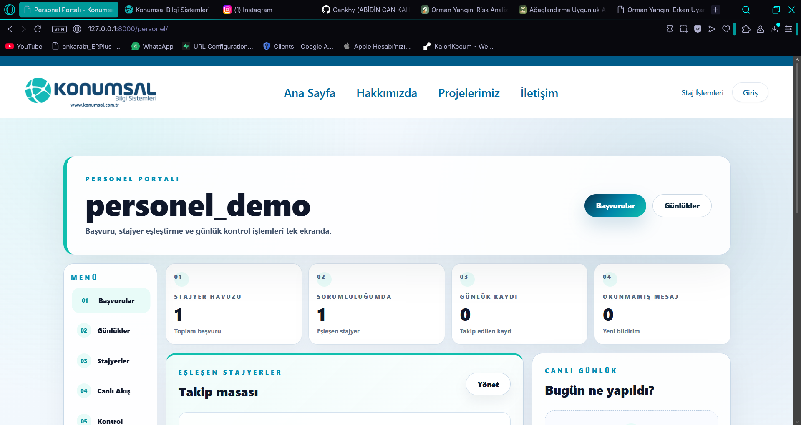
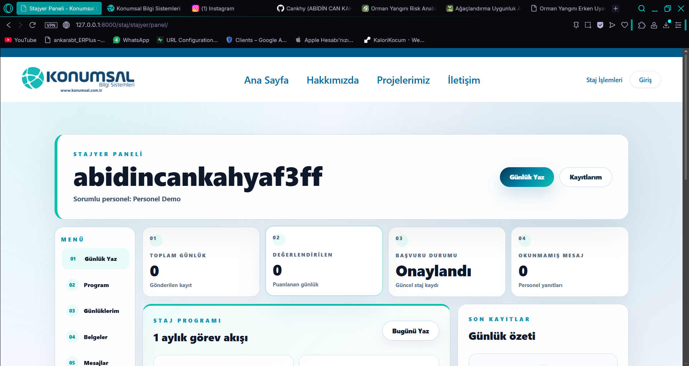
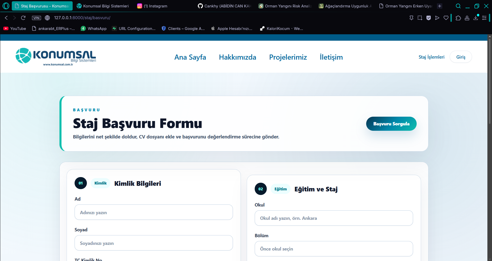
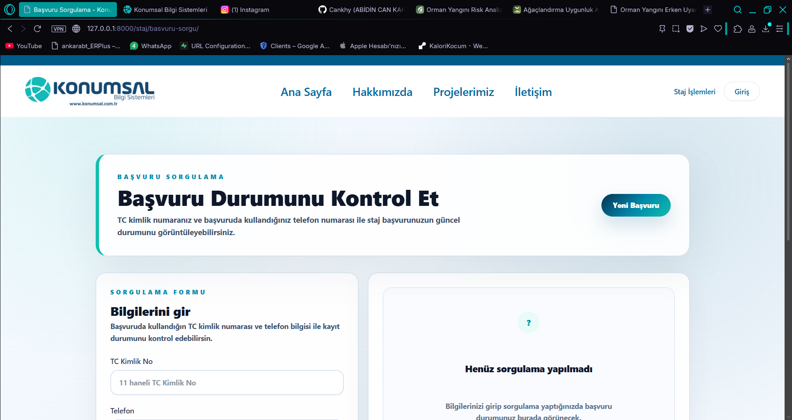
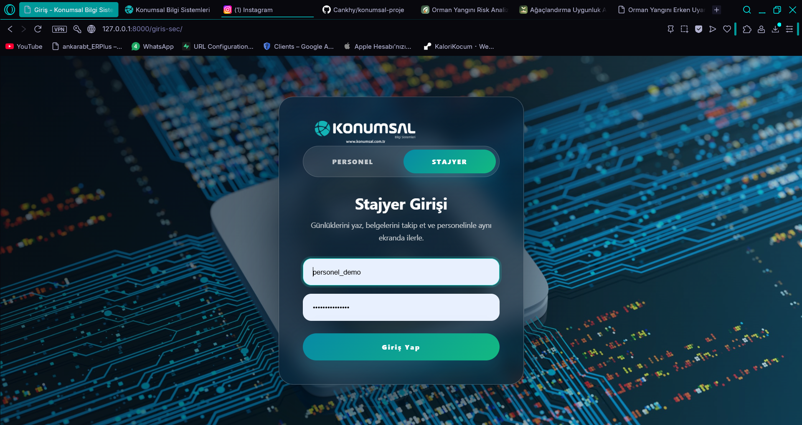
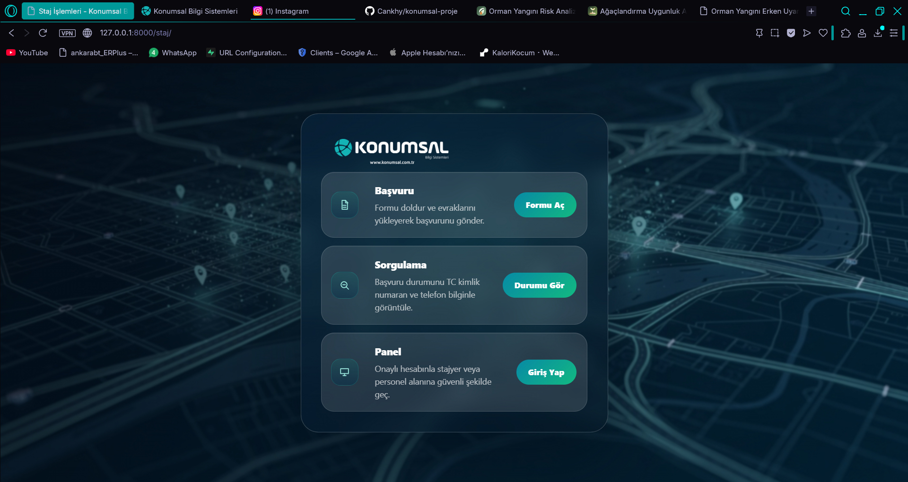
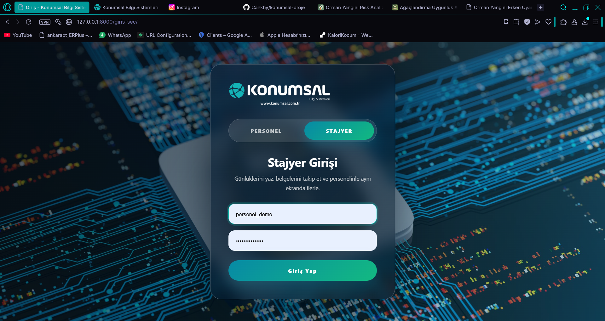
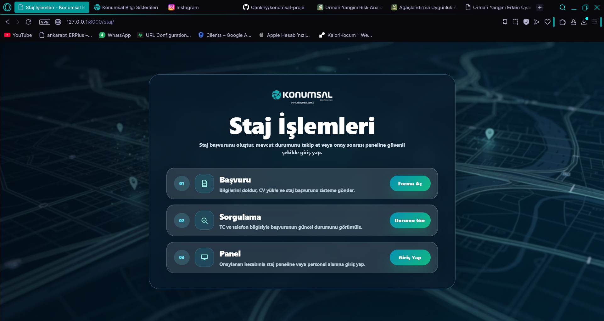

# Konumsal Proje

Konumsal Bilgi Sistemleri için geliştirilen bu proje; staj başvurusu, başvuru sorgulama, stajyer paneli ve personel yönetim ekranlarını tek bir akışta birleştiren `Django` tabanlı bir web uygulamasıdır.

Bu repo, sadece çalışan bir okul / staj projesi değil; aynı zamanda mevcut bir sistemi okuyup yeniden tasarlama, kullanıcı deneyimini iyileştirme, responsive arayüz kurma ve production hazırlığı yapma becerilerimi gösteren kapsamlı bir çalışma örneğidir.

## CV İçin Kısa Proje Özeti

`Django tabanlı staj ve personel yönetim portalında; başvuru, sorgulama, günlük, belge ve mesajlaşma ekranlarını yeniden tasarladım. Arayüz tarafında Tailwind CSS ve özel CSS sistemiyle responsive, daha okunur ve daha profesyonel bir kullanıcı deneyimi oluşturdum. Backend tarafında production ayarları, PostgreSQL uyumu, WhiteNoise, Gunicorn ve ortam değişkeni yönetimi ile projeyi canlı ortama hazır hale getirdim.`

## Proje Amacı

Sistemin temel hedefleri:

- staj başvurularını dijital ortamda toplamak
- başvuru durumlarını kullanıcıya şeffaf biçimde göstermek
- stajyerlerin günlük, belge ve mesaj süreçlerini tek panelden yönetmesini sağlamak
- personelin başvuru ve stajyer takibini tek merkezden yapabilmesini sağlamak

## Kullanılan Teknolojiler

### Backend

- `Python`
- `Django 5`
- `Django REST Framework`
- `SimpleJWT`
- `Gunicorn`
- `WhiteNoise`
- `dj-database-url`
- `psycopg`

### Frontend

- `HTML5`
- `CSS3`
- `Tailwind CSS`
- `JavaScript`
- `Django Template Language`

### Veri / Ortam

- `SQLite` geliştirme ortamı için
- `PostgreSQL` production hedefi için
- `.env` tabanlı ortam değişkeni yönetimi

### DevOps / Yayınlama

- `Git`
- `GitHub`
- `Render` için production hazırlığı
- `Procfile`
- `build.sh`
- `render.yaml`

## Hangi Dilleri ve Yapıları Kullandım?

Bu repo üzerinde aktif olarak şu diller ve yapılandırma formatları ile çalıştım:

- `Python`
- `HTML`
- `CSS`
- `JavaScript`
- `YAML`
- `Shell`

## Teknik Olarak Neler Yaptım?

### 1. Arayüz Sistemini Baştan Düzenledim

- dağınık ekranları ortak bir görsel dil altında topladım
- kart, buton, tipografi ve boşluk sistemini yeniden kurdum
- büyük ve dengesiz blokları daha sade ve profesyonel hale getirdim
- panel ve giriş akışlarını tek ürün hissi verecek şekilde eşitledim

### 2. Personel Panelini Yeniden Kurguladım

- dashboard yapısını daha okunur hale getirdim
- metrik ve bilgi kartlarını dengeledim
- başvuru, günlük ve stajyer takibini daha net bir hiyerarşiye taşıdım
- gereksiz büyük başlık / kullanıcı alanlarını küçülttüm

### 3. Stajyer Panelini İyileştirdim

- ana paneli sadeleştirdim
- günlük, program, belge ve kayıt akışlarını daha kullanışlı hale getirdim
- bilgi yoğunluğunu azaltıp görev odaklı kullanım hissi oluşturdum

### 4. Başvuru ve Sorgulama Akışını Yeniledim

- başvuru formunu daha anlaşılır bölümlere ayırdım
- sorgulama ekranını daha yönlendirici hale getirdim
- boş durum ve işlem öncesi mesajları iyileştirdim

### 5. Günlük, Belge ve Mesajlaşma Alanlarını Geliştirdim

- günlük ekranlarını daha okunur hale getirdim
- belge alanlarını daha düzenli bir yapıya taşıdım
- mesajlaşma tarafında dosya seçimi geri bildirimi ekledim
- kullanım akışında küçük ama etkili UX iyileştirmeleri yaptım

### 6. Giriş Akışlarını Tek Dile Taşıdım

- giriş seçim ekranı
- personel girişi
- stajyer girişi
- şifre değiştirme ekranları
- işlem sonucu bilgilendirme ekranları

aynı tasarım sistemi altında yeniden düzenlendi.

### 7. Responsive ve Mobil Uyum Çalışması Yaptım

- tablo, form ve mesaj alanlarını küçük ekranlara uyarladım
- mobilde taşan alanları temizledim
- kart ve buton boyutlarını mobil kullanıma göre ayarladım

### 8. Production Hazırlığı Yaptım

- `settings.py` dosyasını production senaryosuna uygun hale getirdim
- `DEBUG`, `SECRET_KEY`, `ALLOWED_HOSTS`, `CSRF_TRUSTED_ORIGINS`, `DATABASE_URL` gibi değerleri ortam değişkenlerinden okunacak şekilde yapılandırdım
- `WhiteNoise` ile statik dosya servis yapısını hazırladım
- `SQLite` yanında `PostgreSQL` destekli dağıtım yapısı kurdum
- `build.sh`, `Procfile` ve `render.yaml` ekledim

## Özellikle Yaptığım Sayfalar

Bu çalışma kapsamında doğrudan geliştirdiğim başlıca ekranlar:

- personel paneli
- stajyer paneli
- staj başvuru ekranı
- başvuru sorgulama ekranı
- günlük yazma ve günlük listeleme ekranları
- belge ekranı
- mesajlaşma ekranı
- giriş seçim ekranı
- personel / stajyer giriş ekranları
- şifre değiştirme ekranları
- başvuru başarılı ekranı
- staj işlemleri yönlendirme ekranı

## Ekran Görüntüleri

### Personel Paneli



### Stajyer Paneli



### Başvuru Formu



### Başvuru Sorgulama



### Giriş Seçim Ekranı



### Staj İşlemleri Ekranı



## Before / After

### Giriş Seçim Ekranı

**Önce**



**Sonra**


Yapılan iyileştirmeler:

- logo hizası düzeltildi
- kart düzeni dengelendi
- giriş akışı daha temiz ve premium hale getirildi

### Staj İşlemleri Ekranı

**Önce**



**Sonra**


Yapılan iyileştirmeler:

- gereksiz büyük başlık alanı temizlendi
- numaralı bloklar kaldırıldı
- işlem kartları daha minimal hale getirildi
- logo hizası düzeltildi

## Bu Projede Gösterilen Yetkinlikler

Bu repo üzerinden görülebilecek güçlü yönler:

- mevcut projeyi bozmadan geliştirebilme
- frontend ve backend tarafını birlikte düşünebilme
- Django template yapısında kontrollü revizyon yapabilme
- kullanıcı deneyimi ve okunabilirlik odaklı tasarım kararı verebilme
- responsive arayüz geliştirebilme
- production ayarı ve deploy hazırlığı yapabilme
- Git tabanlı düzenli ilerleme sağlayabilme

## Doğrudan Düzenlenen Önemli Dosyalar

- `website/templates/auth/personnel_home.html`
- `website/templates/internship/intern_dashboard.html`
- `website/templates/internship/apply.html`
- `website/templates/internship/query.html`
- `website/templates/internship/conversation.html`
- `website/templates/internship/intern_documents.html`
- `website/templates/internship/daily_log.html`
- `website/templates/auth/login_select.html`
- `website/templates/internship/login_choice.html`
- `static/css/input.css`
- `static/css/output.css`
- `core/settings.py`
- `requirements.txt`
- `render.yaml`
- `Procfile`
- `build.sh`

## Yerelde Çalıştırma

```powershell
$env:PYTHONPATH = (Resolve-Path '.\venv\Lib\site-packages').Path
py -3 manage.py migrate
py -3 manage.py runserver
```

Tailwind çıktısını yeniden üretmek için:

```powershell
npx tailwindcss -i .\static\css\input.css -o .\static\css\output.css
```

## Production / Deploy Notu

Bu repo production hazırlığı yapılmış bir yapıya sahiptir:

- `PostgreSQL` ile çalışabilecek şekilde ayarlandı
- `Gunicorn` ile servis edilebilir
- `WhiteNoise` ile statik dosyalar yayınlanabilir
- ortam değişkenleri ile güvenli yapılandırma desteklenir

Hazırlanan dağıtım dosyaları:

- `render.yaml`
- `Procfile`
- `build.sh`

## Sonuç

Bu çalışma; sadece birkaç ekranı güzelleştirme işi değil, mevcut bir sistemi daha profesyonel, daha okunur, daha kullanılabilir ve daha yayına hazır hale getirme sürecidir.

Bu repo, `Django backend`, `template tabanlı frontend geliştirme`, `responsive UI tasarımı`, `production hazırlığı` ve `ürün odaklı iyileştirme` alanlarında somut çıktı üretebildiğimi gösteren güçlü bir portföy parçasıdır.
